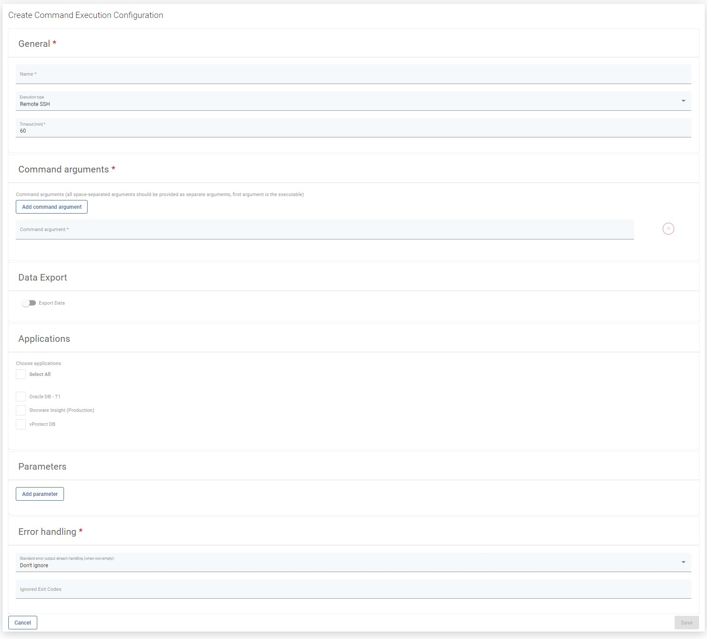

# Execution Configurations

From this tab, you can create a command execution configuration, i.e. commands executed for the proper backup of your application \(or directed to the script file\).

1. Prepare script or commands and \(if remote SSH execution is required\) put them on the remote machine with your application
2. In the Applications section create a new **Command Execution Configuration**

_\*\*_ this is a description of how your script is going to be invoked - you need to specify:

* **Command arguments** \(first one is the actual executable\) - all arguments should be provided separately - vProtect assumes that they can contain spaces
* **CMD execution method** - either on the Node or a command to be executed remotely
* select existing **Applications** \(or skip that for now - it can be assigned later\)
* **Export data** - this switch allows you to export \(or not\) data that will be generated by the command \(sometimes you may wish vProtect just to execute commands without transferring anything\)
* **Source type** \(if you export data\)
  * **FILE** - select if your command produces a single file/directory \(or multiple files\) - if you provide directory or path with wildcards, vProtect will create a TAR archive - you have to specify **Source Path** for this source type
  * **STREAM** - select if your command generates backup to the standard output
* **Timeout** - for script/command execution - make sure to have this timeout set to the value high enough to allow your command to complete its execution
* Optionally you can define **environment variables** that you'll later be able to use in your commands/scripts. Note, that the variable name should not contain white-space characters.\*\*

