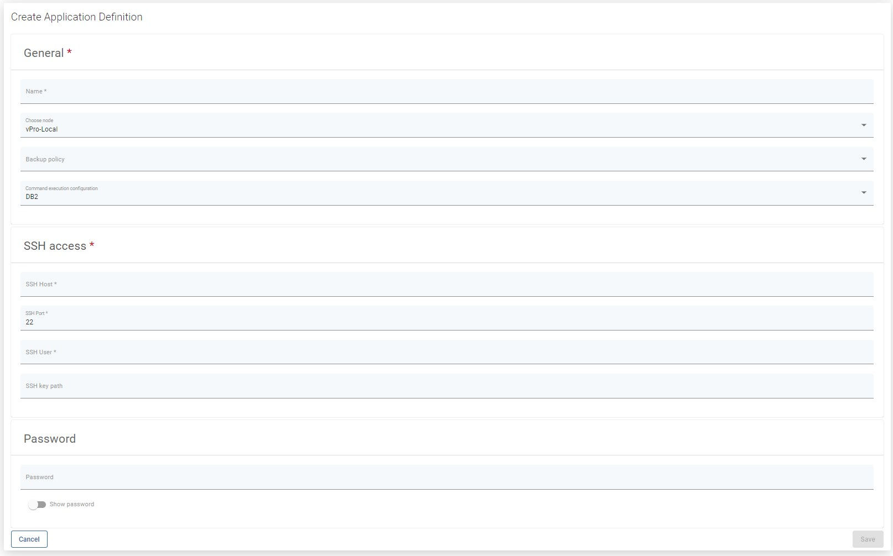
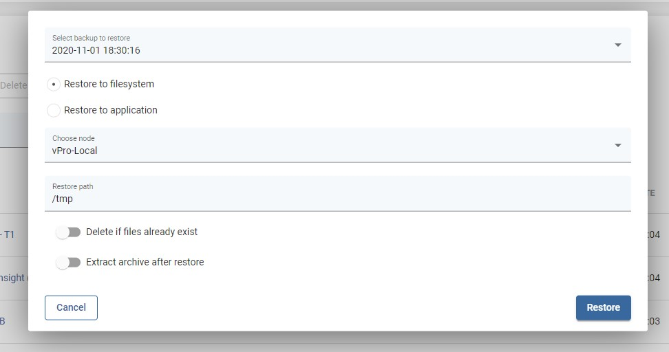
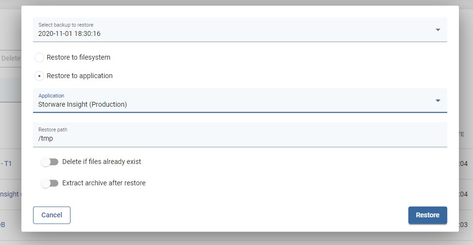
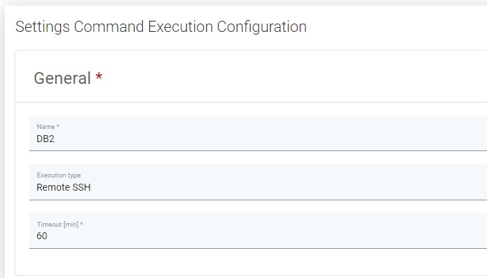

# Instances

## General

This tab allows you to create an "Application definition" and execute on-demand actions like:

* Clone  
* Backup  
* Restore  
* Delete

### Example - How to create an application definition

You need to provide at least its **name** and **Command Execution Configuration** and select **node** which is going to do the work - for command execution that have execution type "node".  
If the command execution type is "remote ssh" you need also to provide ssh access.  
To schedule backup of application, you need to select backup policy - more about policies and schedules you can find in this article: [Backup SLAs](backup-slas.md)

### Example - How to restore application

To perform an on-demand application restore, click the restore button on the right side of the application line.

After clicking on it, you will see a pop-up window where you can customize restore options.

If you choose the "Restore to filesystem" option, you can select things like which backup you want to restore, on which node you want to restore files, etc.

The "Restore to application" option differs in that it allows you to restore files to the server where the application is located.\*\*

\*\*This option is available for applications using "Remote SSH" in the command execution configuration

