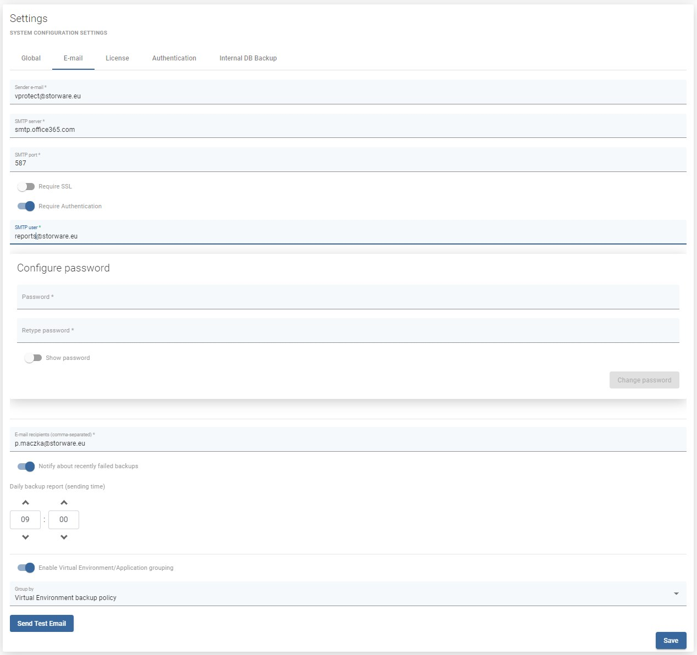
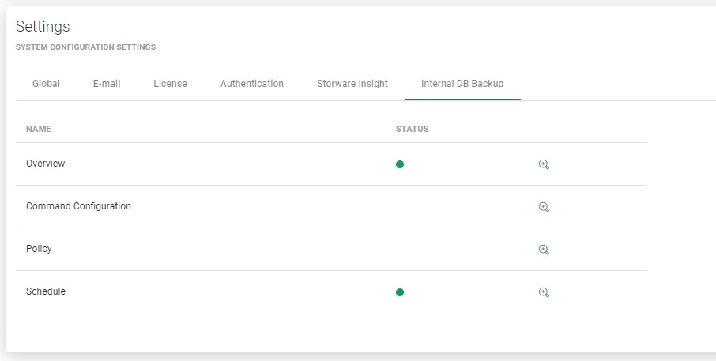

# Settings

## Global

Global value settings for some retentions and schedules:

* `Node status update interval` - how often nodes should update their status
* `Backup history retention` - how long should the history of backups be kept \(even removed from backup provider\)
* `Task retention (in console)` - how long finished/failed tasks should be kept in the console in UI/CLI
* `Periodic index interval` - how often vProtect should scan for changes in VM inventory on HV/HVMs
* `Old backups removal time` - time, when daily backup destination cleanup should be invoked \(for all backup destinations\)
* `Old snapshots removal time` - time, when daily snapshots cleanup should be invoked \(for all VMs with any policy assigned\)
* `Session timeout [min]` - Session timeout \[min\] - the time after which you will be logged out of the WebUI
* `Default paging size` - Default value of items shown on lists

## E-mail

Email configuration for reports purposes

* `Sender e-mail` - address from which should e-mail be sent 
* `SMTP server` - SMTP server address 
* `SMTP port` - SMTP server port 
* `SMTP SSL port` - SMTP SSL port \(if enabled\) 
* `SMTP user` - SMTP user used to send e-mails 
* `E-mail recipients (comma-separated)` - list of recipients of daily backup report
* `Daily backup report (sending time)` - time when daily backup report should be sent
* `Notify about recently failed backups` - if enabled, an e-mail will be sent if there were any failed export/store tasks within the last 15 minutes
* `Daily backup report` - sending time for summary report
* `Enable virtual environment/application grouping` - you can group environment by selected parameter

## License

This section enables you to view current license status and upload a new license if necessary.

License details:

* `MAX_xxx_HOSTS` - maximum number of hosts for a given platform
* `BP_xxx` - maximum number of backup destinations per backup provider type
* `EXPIRE_DATE` - trial period expiration date

## Authentication

This section enables you to setup LDAP authentication for administrative accounts in vProtect:

* `Enable LDAP authentication` - enables LDAP authentication, vProtect will try to check for non-existing accounts in LDAP, and if authenticated successfully, a new account will appear on the list
* `Server URL` - LDAP server URL
* `Base DN` - Base DN that needs to be searched
* `User filter` - filter to be used to authenticate only users in a specific group
* `Enable LDAP subtree search` - when disabled, only 1 level below base DN is being searched
* `Use SSL` - enables SSL for LDAP connection
* `Use TLS` - enables TLS for LDAP connection
* `Anonymous access allowed` - if users are not allowed to anonymously browse the LDAP directory you need to provide an account which has that privilege:
* `Service account DN` - DN of the user
* `Service account password` - password of that user 

## Storware Insight

Storware Insight reporting is a mechanism that allows the vProtect Server to sent periodic status reports. This will help the support team to see the status and basic information of your environment and provide better support in the future.

* `Enable status reporting` - enables daily reporting
* `Show report contents` button - allows you would to preview the contents of the report being sent

## Internal DB backup

It allows you to control the process of creating an internal database backup from one place. Clicking the magnifying glass icon will take you to the appropriate menu.

