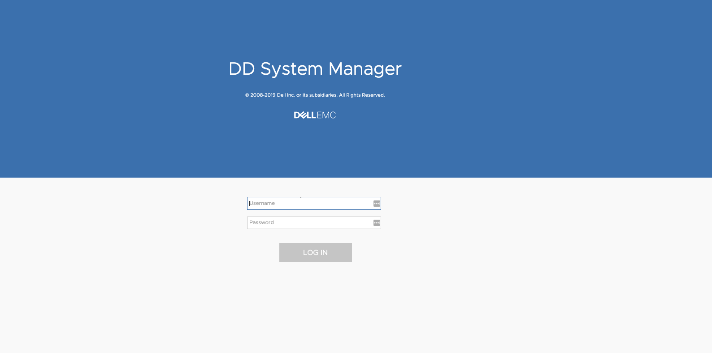
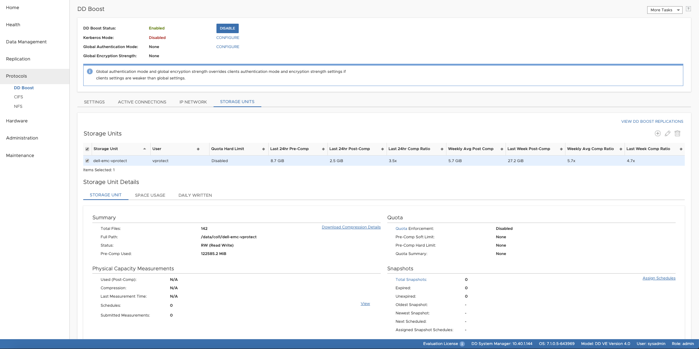

# Dell EMC Data Domain

## Create a new Backup Destination \(Dell EMC Data Domain\)

* Go into a backup destination menu and click create a backup destination
* Provide a name and description for a new backup destination
* Specify retention days for full and incremental backups
* Specify retention versions for full and incremental backups
* Choose and assign node configuration, to which you want to attach a new backup destination
* Add to one or more storage paths
  * `example - /vprotect_data/backupdestination` 
* Enable/disable deduplication
* Save configuration 

## DD Boost FS Plugin

**Note:**

* to boost the backup process we recommend to use **single** Storage Unit and mtree and use subfolders on the BoostFS for multiple backup destinations \(with possibly different retention settings\)
  * no additional data copy is needed in store phase, when staging is using the same file system as the backup destination
  * setup assumes a single Storage Unit and a single mtree for all backup destinations
  * staging space should always be a top directory, and all backup destinations should be defined as separate subfolders of this file system
  * vProtect handles retention and each backup destination may have different retention configured
  * single Storage Unit also will affect replication as it has to cover all backup destinations, and may replicate temporary data from staging space or mounted backups
* **sharing** the same BoostFS across multiple nodes allows administrator to create backups on one node \(i.e. one host/environment\) and restore using a different node \(to the different host/environment\)
* UID/GID ownership and permissions must allow vProtect to read/write contents of the BoostFS share 

Prepare your PowerProtect DD as a backup destination:

* Login to PowerProtect DD and create NFS Storage Unit called `storware-vprotect`





* Download BoostFS RPM from Dell EMC site
* Install BoostFS:

  ```text
  rpm -ivh DDBoostFS-7.0.0.0-633922.rhel.x86_64.rpm
  ```

* Mount it on vProtect Node \(`DD_BOOST_IP` should be replaced with IP of your PowerProtect DD\):

  ```text
  /opt/emc/boostfs/bin/boostfs lockbox set -d ip_address -u vprotect -s dell-emc-vprotect
  ```

* Create a directory mkdir /vprotect\_data/backups

  ```text
  /opt/emc/boostfs/bin/boostfs mount -o allow-others=true -d ip_address -s dell-emc-vprotect
  /vprotect_data/backups
  ```

* Confirm with `df` that your `/vprotect_data/backups`

